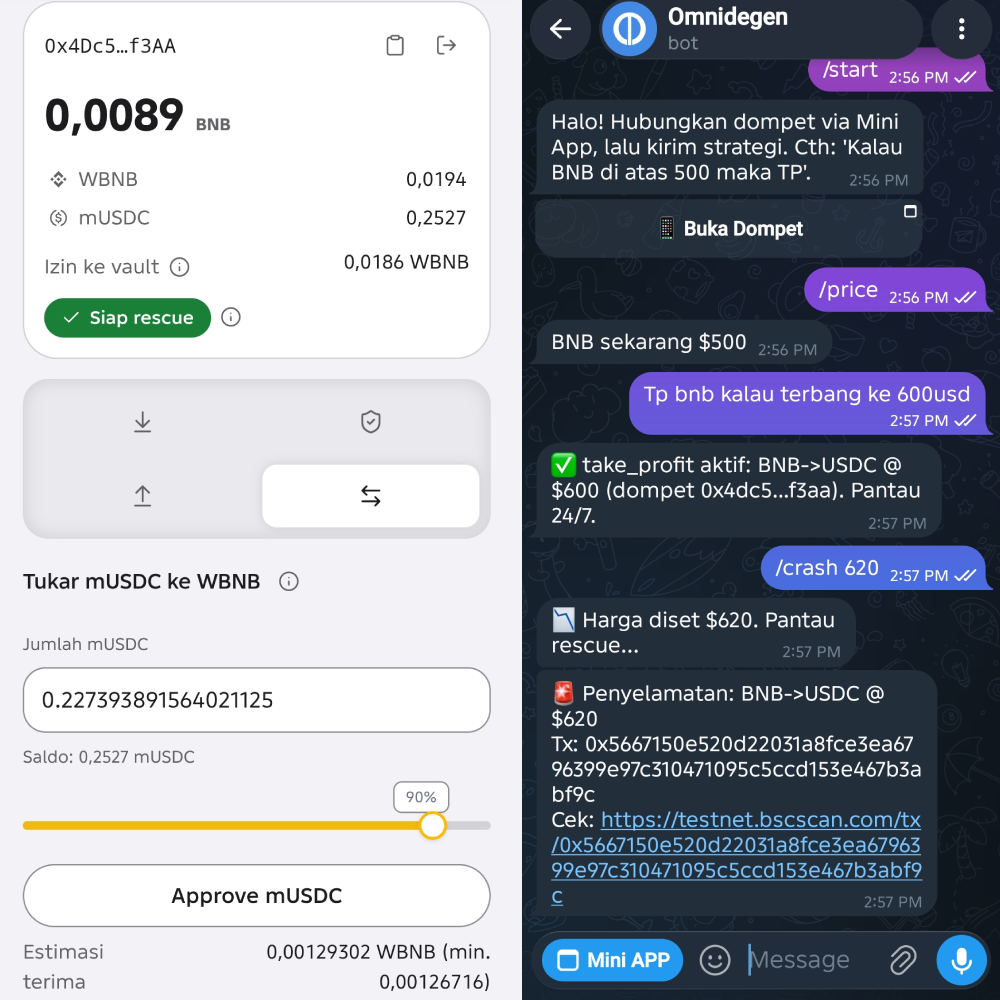
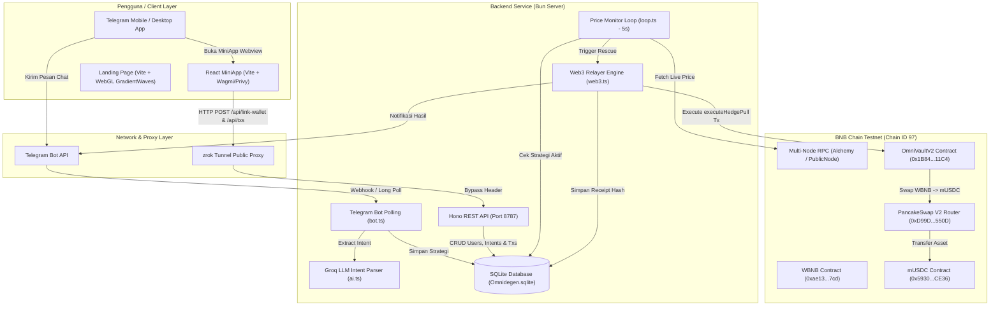

# Omnidegen — Asisten Strategi Kripto di Telegram

Omnidegen adalah tool untuk mengamankan aset kripto secara otomatis — seperti Grab untuk pesan ojek online, Omnidegen untuk pasang strategi stop-loss / take-profit lewat chat, lalu dieksekusi otomatis on-chain 24/7.

Bot: https://t.me/omnidegen_bot



## Arsitektur Infrastruktur (Infrastructure)



## Untuk pengguna: cara pakai (5 menit)

**1. Hubungkan dompet.** Buka bot → `/start` → Buka Mini App → Hubungkan Dompet (MetaMask atau Rabby). Bot mengenali dompetmu otomatis, tanpa tempel alamat manual.

**2. Siapkan dana (testnet BSC).** Isi tBNB dari faucet → **Wrap** jadi WBNB → **Approve** vault (batas bisa diatur, bisa dicabut kapan saja). Dana tetap di dompetmu; vault hanya boleh menarik sebatas izin.

**3. Kirim strategi via chat.** Contoh:
- `TP BNB kalau terbang ke 500` → take profit aktif
- `CL BNB kalau di bawah 400` → stop loss aktif

**4. Terima hasil.** Saat trigger tersentuh kamu dapat notifikasi + hash transaksi asli yang bisa diklik ke bscscan. Semua tercatat di tab Riwayat dan Transaksi.

**Fitur dompet di Mini App:** saldo BNB/WBNB/mUSDC + izin vault, unwrap WBNB→BNB, tukar balik mUSDC→WBNB (quote live, slippage 2%), cabut izin, kurs pool live, input persen + slider.

**Yang perlu kamu tahu:** bot hanya bisa JUAL otomatis (hedge ke USDC). Minta "beli" akan ditolak dengan arahan (beli manual lewat tab Tukar). Target hedge yang didukung: USDC. Strategi sekali pakai (fire sekali lalu selesai, tercatat di riwayat).

## Untuk teknikal (ringkas)

```text
Chat Telegram → Groq (parse sekali jadi JSON) → SQLite (users, intents)
Mini App → initData tervalidasi → POST /api/* → SQLite yang sama
Loop 5 dtk → trigger? → relayer executeHedgePull → Pancake WBNB→mUSDC
  → tunggu receipt → sukses/notif+link, gagal/jujur+failed
```

- **Non-custodial**: pull-model, allowance-cap, revocable, tanpa recipient param.
- **Kejujuran eksekusi**: sukses hanya bila receipt `success`; hash real disimpan di baris intent; mock tak pernah dapat link explorer.
- **Guardrail**: validasi target, tolak prompt jahat (validator + `revert` on-chain), tolak beli otomatis, normalisasi USDT→USDC, cleanup intent dompet lama, slippage 2% dari quote on-chain.
- **Kontrak (BSC testnet chain 97)**: VaultV2 `0x1B846f…04511C4`, mUSDC `0x5930d7…c2CE36`, router Pancake `0xD99D1c…16550D`.

```bash
cp .env.example .env   # TELEGRAM_BOT_TOKEN, GROQ_API_KEY, BACKEND_PRIVATE_KEY,
                       # RPC_URL (+_FALLBACK), VAULT_CONTRACT_ADDRESS, MUSDC_ADDRESS,
                       # DB_PATH, MOCK_TX=false untuk real, SLIPPAGE_BPS, API_*
bun install && bun test            # backend 43 test
bunx tsc --noEmit -p tsconfig.json
forge test --root contracts        # kontrak: unit + fork
bun run src/index.ts               # bot + monitor + API
cd miniapp && bun run build        # tsc + lint + build Mini App
cd landing-page && bun run build   # tsc + build Landing Page
```

Bot: `/start` `/app` · `/info` & `/approve` redirect ke Mini App · natural language + konfirmasi YA untuk aksi instan · `/price` · `/crash` (admin).

**Struktur**: `src/` (api, bot, loop, web3, db, ai, telegram-auth) · `contracts/` (Foundry, OmniVaultV2 pull-model) · `miniapp/` (TokenTabs, StrategiesPanel 3-tab, PoolLiveCard, ui reuse, debug `?debug=1`) · `landing-page/` (Vite + React + WebGL GradientWaves).

**Catatan produksi**: SQLite file → Postgres saat besar; single relayer key → session key; testnet-only (mUSDC mock, pool tipis).
